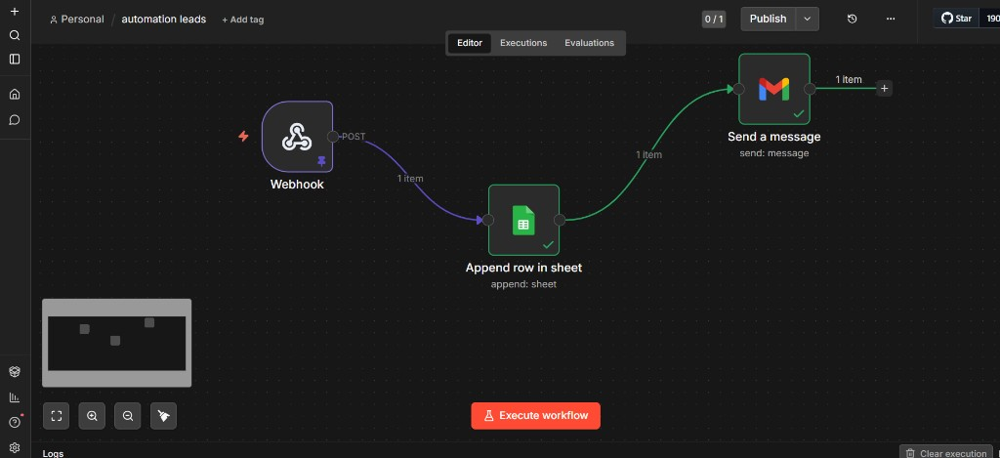
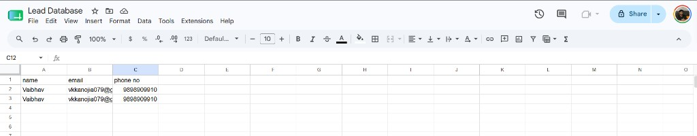
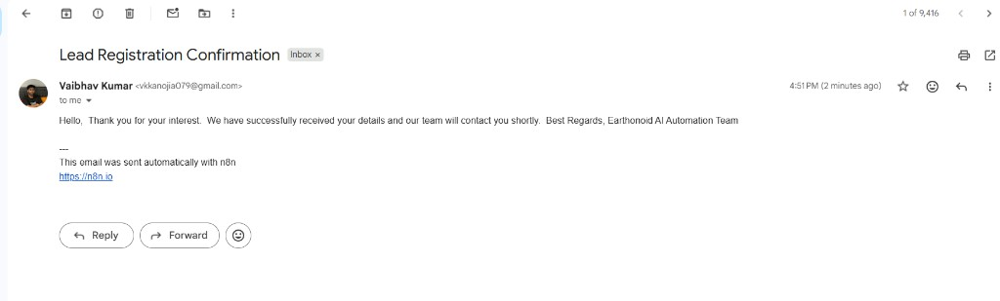

# Lead Automation Workflow

**Earthonoid AI Automation Developer Internship — Question 1**  
**Candidate:** Vaibhav Kumar  
**Workflow:** `automation leads` (n8n)

---

## Project Overview

This project implements an end-to-end **lead capture automation** using [n8n](https://n8n.io). When a lead submits their details via a **POST webhook**, the workflow stores the record in **Google Sheets** and sends a **Gmail confirmation** to the lead automatically.

The solution demonstrates webhook integration, spreadsheet logging, email notification, and successful workflow execution with supporting screenshots and a demo video.

---

## Objective

Build a production-style automation pipeline that:

1. Receives lead data from external systems (forms, landing pages, CRM hooks) via webhook  
2. Persists leads in a centralized **Lead Database** Google Sheet  
3. Sends an immediate **confirmation email** to the lead  
4. Runs reliably with minimal manual intervention  

---

## Workflow Architecture

```
Webhook (POST /lead-form)
        ↓
Google Sheets (Append row → Lead Database)
        ↓
Gmail (Send confirmation email)
```

| Step | Node | Role |
|------|------|------|
| 1 | **Webhook** | Entry trigger; accepts JSON lead payload |
| 2 | **Append row in sheet** | Writes `name`, `email`, `phone no` to Sheet1 |
| 3 | **Send a message** | Sends confirmation to `{{ $json.email }}` |

**Workflow export:** [`automation_leads.json`](./automation_leads.json)

---

## Features

- **POST webhook** trigger on path `lead-form`
- **OAuth2** Google Sheets and Gmail credentials
- **Append row** to spreadsheet *Lead Database*
- **Automated confirmation email** with Earthonoid branding
- **Linear pipeline** — easy to audit and extend
- **Active workflow** — ready for production webhook URL

---

## Workflow Components

### Webhook Trigger

| Property | Value |
|----------|--------|
| HTTP method | `POST` |
| Path | `lead-form` |
| Node type | `n8n-nodes-base.webhook` (v2.1) |

Incoming JSON is passed to the next node. Example test payload (see [Sample Input](#sample-input-payload)).

### Google Sheets Integration

| Property | Value |
|----------|--------|
| Operation | Append row |
| Spreadsheet | **Lead Database** |
| Sheet | Sheet1 (`gid=0`) |
| Columns | `name`, `email`, `phone no` |
| Credential | Google Sheets OAuth2 |

Each successful webhook run adds one row to the lead log.

### Gmail Integration

| Property | Value |
|----------|--------|
| To | `={{ $json.email }}` (from Sheets node output) |
| Subject | Lead Registration Confirmation |
| Credential | Gmail OAuth2 |

**Message (summary):** Thanks the lead, confirms receipt, and signs off as *Earthonoid AI Automation Team*.

---

## Execution Flow

1. **Trigger** — Client sends `POST` to the n8n webhook URL with lead JSON.  
2. **Store** — Google Sheets appends a new row with name, email, and phone.  
3. **Notify** — Gmail sends a text confirmation to the lead’s email address.  
4. **Complete** — All three nodes show success (green checkmarks); execution log shows 1 item per step.

---

## Sample Input Payload

```json
{
  "Name": "Vaibhav",
  "Email": "vkkanojia079@gmail.com",
  "Phone": "9876543210"
}
```

**Test with curl (replace with your production webhook URL):**

```bash
curl -X POST "https://YOUR-N8N-INSTANCE/webhook/lead-form" \
  -H "Content-Type: application/json" \
  -d "{\"Name\":\"Vaibhav\",\"Email\":\"vkkanojia079@gmail.com\",\"Phone\":\"9876543210\"}"
```

---

## Sample Output

- Lead row appended in **Lead Database** Google Sheet  
- **Lead Registration Confirmation** email delivered to the lead  
- n8n execution: all nodes succeeded (1 item each)

---

## Screenshots

| Evidence | File |
|----------|------|
| Workflow canvas (successful run) | [`screenshots/workflow_canvas.png`](./screenshots/workflow_canvas.png) |
| Google Sheet updated | [`screenshots/google_sheet_updated.png`](./screenshots/google_sheet_updated.png) |
| Gmail confirmation | [`screenshots/gmail_confirmation.png`](./screenshots/gmail_confirmation.png) |
| Webhook test | *Add `screenshots/webhook_test.png`* |
| Execution detail | *Add `screenshots/execution_success.png`* |







---

## Demo Video

Place your screen recording here:

- **Folder:** [`demo-video/`](./demo-video/)
- **Suggested filename:** `demo_video.mp4`
- **Script:** [`demo-video/demo_script.md`](./demo-video/demo_script.md)

---

## Business Benefits

| Benefit | Impact |
|---------|--------|
| **Instant capture** | No manual copy-paste from forms |
| **Centralized data** | All leads in one Google Sheet for sales/ops |
| **Lead experience** | Immediate confirmation builds trust |
| **Scalability** | Same workflow handles unlimited submissions |
| **Auditability** | n8n execution history for debugging |
| **Low code** | Visual workflow; faster iteration than custom scripts |

---

## Technologies Used

- [n8n](https://n8n.io) — workflow automation  
- Webhook (HTTP POST) — ingress API  
- Google Sheets API (OAuth2) — data storage  
- Gmail API (OAuth2) — transactional email  

---

## Future Improvements

1. Map Sheets columns dynamically from webhook fields (`={{ $json.body.Name }}`) instead of static test values in the export  
2. Normalize field names (`Name` / `name`) with a **Set** or **Code** node  
3. Add **error handling** (IF node + Slack/email alert on failure)  
4. Deduplicate leads by email before append  
5. Add **Respond to Webhook** node with JSON `{ "success": true }`  
6. Remove or customize the default n8n email footer for production  
7. Add webhook authentication (header secret or API key)  

---

## Assignment Outcome

This submission demonstrates:

- Lead capture automation end-to-end  
- Webhook, Google Sheets, and Gmail integrations  
- Successful execution with visual proof  
- Professional GitHub documentation  

**Further reading:** [`docs/project_overview.md`](./docs/project_overview.md)  
**Submission checklist:** [`SUBMISSION_CHECKLIST.md`](./SUBMISSION_CHECKLIST.md)

---

## Repository Structure

```
Lead_automation/
├── README.md
├── SUBMISSION_CHECKLIST.md
├── automation_leads.json
├── screenshots/
│   ├── workflow_canvas.png
│   ├── google_sheet_updated.png
│   ├── gmail_confirmation.png
│   ├── webhook_test.png          (recommended)
│   └── execution_success.png     (recommended)
├── demo-video/
│   ├── demo_script.md
│   └── demo_video.mp4            (upload your recording)
└── docs/
    └── project_overview.md
```

---

*Earthonoid AI Automation Developer Internship — Question 1*
